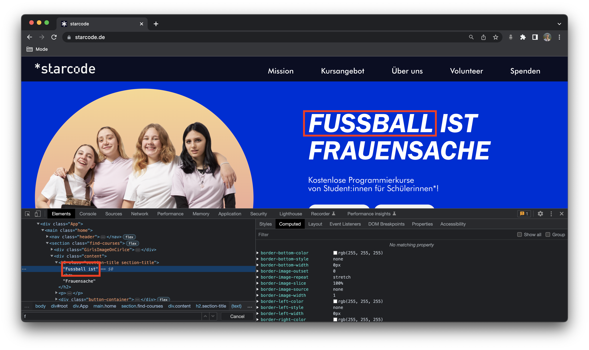
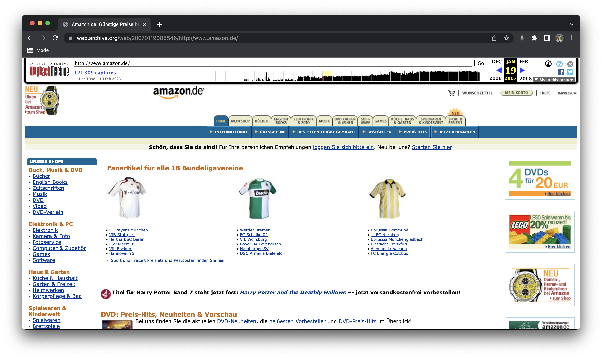

# Introduction to Web Development

## Schedule

[1 Vorstellung](#1-vorstellung)  
[2 Einführung in die Informatik](#2-einführung-in-die-informatik)  
[3 Einführung in die Webentwicklung](#3-einführung-in-die-webentwicklung)  
[4 Webprogrammierung Showcase](#4-webprogrammierung-showcase)  
[5 Geschichte der Webprogrammierung](#5-geschichte-der-webprogrammierung)  
[6 Sneak Peak in HTML und CSS](#6-sneak-peak-in-html-und-css)  
[7 Abschluss](#7-abschluss)

## 1 Vorstellung

Jeder stellt sich kurz vor:

- Name
- Alter
- Klasse
- 2 Wahrheiten und 1 Lüge

## 2 Einführung in die Informatik

**Fragen:**

- Was ist Informatik für euch?
- Wo seht ihr Informatik in eurem Alltag?
- Was für Berührungen hattet ihr mit Informatik bereits?

**Kurze Intro: Was ist Informatik?**

Die Informatik ist ein spannendes Feld, das sich mit der Technologie und dem Computer beschäftigt. Es geht darum, wie man Computer benutzt, um Probleme zu lösen und Dinge zu automatisieren. In der heutigen Welt sind Computer allgegenwärtig und haben einen großen Einfluss auf unser tägliches Leben. Sie sind in unseren Handys, Tablets, Laptops, Spielkonsolen und sogar in unseren Autos und Haushaltsgeräten vorhanden.

Wenn du dich für Informatik interessierst, kannst du lernen, wie man Spiele oder Animationen programmieren oder wie man Webseiten erstellt. Du kannst auch lernen, wie man eine Datenbank erstellt oder wie man ein Netzwerk einrichtet. Das Schöne an der Informatik ist, dass es so viele Möglichkeiten gibt und dass du deine eigenen Projekte erstellen und Ideen umsetzen kannst.

Insgesamt ist die Informatik ein tolles Thema, das dir Fähigkeiten vermitteln kann, die du für deine Zukunft brauchen wirst. Wenn du dich für Technologie interessierst und gerne Dinge erforschst und kreierst, dann ist die Informatik das richtige Fach für dich!

## 3 Einführung in die Webprogrammierung

Webprogrammierung ist ein spannendes und kreatives Feld, das sich mit der Erstellung von Websites beschäftigt.

In der Webprogrammierung lernen wir, wie man Websites erstellt, die Text, Bilder und Videos enthalten. Wir lernen auch, wie man interaktive Funktionen wie Buttons, Formulare und Animationen hinzufügt.

Ein wichtiger Teil der Webprogrammierung ist die Verwendung von Sprachen wie HTML, CSS und JavaScript.

- **HTML** wird verwendet, um den Inhalt deiner Website zu strukturieren (wie das Skelett eines Hauses)
- **CSS** um das Aussehen deiner Website zu gestalten und (wie die Farbe und das Design deines Hauses)
- **JavaScript** um interaktive Funktionen hinzuzufügen (wie die Elektrik die das Haus zum Leben erweckt)

Wenn du diese Sprachen beherrschst, könnt ihr am Ende des Kurses eure eigenen Websites erstellen und sogar andere Websites verbessern.

**Frage:**
Was wollt ihr in diesem Kurs lernen?

## 4 Webprogrammierung Showcase

Wir schauen uns einige Websites an, die mit HTML, CSS und JavaScript erstellt wurden.

**Aufgabe:**

1. Geht auf eine beliebige Website im Chrome-Browser (z.B. https://www.starcode.de)
2. Klickt mit der rechten Maustaste auf die Website und wählt "Untersuchen"
3. Schaut euch die HTML-Struktur der Website an (Section "Elements")
4. Wählt eine Überschrift aus (mit Doppelklick) und ändert den Text
   
5. Klickt auf das "Styles"-Tab und ändert die Farbe der Überschrift
   

## 5 Geschichte der Webprogrammierung

Wir schauen uns an wie die Webprogrammierung sich entwickelt hat. Früher sahen Websites noch anders aus als heute, wo sie sehr interaktiv und ansprechend sind. Daher wollen wir uns ansehen, wie einige bekannte Websites früher aussahen.

**Aufgabe:**

1. Geht auf https://web.archive.org
2. Sucht nach einer beliebigen Website (z.B. https://www.amazon.de)
3. Klickt oben den Zeitpunkt an, zu dem ihr die Website sehen wollt

Beispiel: Amazon im Jahr 2007


## 6 Sneak Peak in HTML und CSS

Jetzt haben wir bereits einiges gesehen, aber wollen endlich mal selber etwas programmieren.

**Aufgabe:**

1. Öffnet die Website https://codeply.com
2. Klickt auf "New Ply"
3. Schreibt in das HTML Feld folgenden Code:

   ```html
   <h1>Deine Überschrift</h1>
   ```

4. Klickt auf "Run"
5. Schreibt in das CSS Feld folgenden Code:

   ```css
   h1 {
     color: red;
   }
   ```

6. Klickt auf "Run"
7. Schreibt in das CSS Feld folgenden Code:

   ```css
   body {
     background-color: black;
   }
   ```

8. Klickt auf "Run"

## 7 Abschluss

Nächste Woche werden wir uns mit HTML und CSS beschäftigen und eine eigene Website erstellen.

Probiert gerne mal zuhause aus, und spielt auf https://codeply.com herum.
